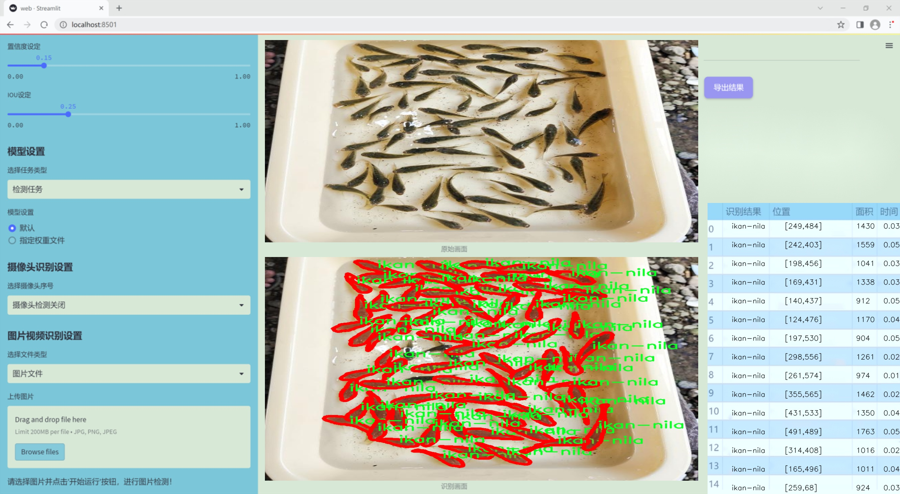

### 1.背景意义

研究背景与意义

随着水产养殖业的快速发展，鱼苗的高效检测与管理成为了提升养殖效率和保证水产品质量的重要环节。鱼苗的种类繁多，尤其是尼罗河鲈（ikan-nila）作为一种经济价值较高的淡水鱼，其养殖需求日益增加。然而，传统的人工检测方法不仅耗时耗力，而且容易受到人为因素的影响，导致检测结果的不准确性。因此，基于计算机视觉的自动化检测系统应运而生，成为解决这一问题的有效手段。

在众多计算机视觉技术中，YOLO（You Only Look Once）系列算法因其高效性和实时性被广泛应用于物体检测任务。YOLOv11作为该系列的最新版本，结合了深度学习和卷积神经网络的优势，能够在保持高准确率的同时实现快速检测。针对鱼苗的检测任务，改进YOLOv11模型将为提升检测精度和速度提供新的可能性。

本研究所使用的数据集包含407张经过标注的鱼苗图像，专注于ikan-nila这一单一类别。这一数据集的构建经过了精心的预处理，包括图像的自动方向调整和统一的尺寸调整，确保了数据的一致性和可用性。尽管未应用图像增强技术，但其高质量的标注为模型的训练提供了坚实的基础。

通过改进YOLOv11模型，我们旨在构建一个高效的鱼苗检测系统，能够在实际养殖环境中实时识别和计数鱼苗。这不仅将提升养殖管理的智能化水平，还能为水产养殖业的可持续发展提供技术支持。最终，本研究的成果将为水产养殖领域的数字化转型贡献力量，推动行业的现代化进程。

### 2.视频效果

[2.1 视频效果](https://www.bilibili.com/video/BV1VbUGYpEJg/)

### 3.图片效果




##### [项目涉及的源码数据来源链接](https://kdocs.cn/l/cszuIiCKVNis)**

注意：本项目提供训练的数据集和训练教程,由于版本持续更新,暂不提供权重文件（best.pt）,请按照6.训练教程进行训练后实现上图演示的效果。

### 4.数据集信息

##### 4.1 本项目数据集类别数＆类别名

nc: 1
names: ['ikan-nila']


该项目为【图像分割】数据集，请在【训练教程和Web端加载模型教程（第三步）】这一步的时候按照【图像分割】部分的教程来训练

##### 4.2 本项目数据集信息介绍

本项目数据集信息介绍

本项目旨在改进YOLOv11的鱼苗检测系统，所使用的数据集专注于“benih”这一主题，具体涵盖了鱼苗的检测与识别。数据集中包含的类别数量为1，主要类别为“ikan-nila”，即尼罗河鲤鱼的鱼苗。这一数据集的构建旨在为鱼苗的自动检测提供高质量的训练样本，以提升模型在实际应用中的准确性和效率。

在数据集的构建过程中，我们特别注重样本的多样性和代表性，确保涵盖不同生长阶段、不同光照条件以及不同背景环境下的“ikan-nila”鱼苗图像。这些图像经过精心标注，确保每个样本都能为模型的训练提供有效的信息。通过对鱼苗的细致标注，数据集不仅能够帮助模型学习到鱼苗的外观特征，还能增强其在复杂环境下的识别能力。

此外，数据集的图像来源广泛，涵盖了自然水域和人工养殖环境，力求反映出鱼苗在不同生态系统中的真实状态。这种多样化的样本选择将有助于提高YOLOv11模型的泛化能力，使其在面对实际应用场景时，能够更准确地识别和定位“ikan-nila”鱼苗。

综上所述，本项目的数据集为改进YOLOv11的鱼苗检测系统提供了坚实的基础，凭借其高质量的样本和丰富的多样性，预计将显著提升模型的性能，为水产养殖行业的智能化发展贡献力量。


### 5.全套项目环境部署视频教程（零基础手把手教学）

[5.1 所需软件PyCharm和Anaconda安装教程（第一步）](https://www.bilibili.com/video/BV1BoC1YCEKi/?spm_id_from=333.999.0.0&vd_source=bc9aec86d164b67a7004b996143742dc)


[5.2 安装Python虚拟环境创建和依赖库安装视频教程（第二步）](https://www.bilibili.com/video/BV1ZoC1YCEBw?spm_id_from=333.788.videopod.sections&vd_source=bc9aec86d164b67a7004b996143742dc)

### 6.改进YOLOv11训练教程和Web_UI前端加载模型教程（零基础手把手教学）

[6.1 改进YOLOv11训练教程和Web_UI前端加载模型教程（第三步）](https://www.bilibili.com/video/BV1BoC1YCEhR?spm_id_from=333.788.videopod.sections&vd_source=bc9aec86d164b67a7004b996143742dc)


按照上面的训练视频教程链接加载项目提供的数据集，运行train.py即可开始训练



     Epoch   gpu_mem       box       obj       cls    labels  img_size
     1/200     20.8G   0.01576   0.01955  0.007536        22      1280: 100%|██████████| 849/849 [14:42<00:00,  1.04s/it]
               Class     Images     Labels          P          R     mAP@.5 mAP@.5:.95: 100%|██████████| 213/213 [01:14<00:00,  2.87it/s]
                 all       3395      17314      0.994      0.957      0.0957      0.0843

     Epoch   gpu_mem       box       obj       cls    labels  img_size
     2/200     20.8G   0.01578   0.01923  0.007006        22      1280: 100%|██████████| 849/849 [14:44<00:00,  1.04s/it]
               Class     Images     Labels          P          R     mAP@.5 mAP@.5:.95: 100%|██████████| 213/213 [01:12<00:00,  2.95it/s]
                 all       3395      17314      0.996      0.956      0.0957      0.0845

     Epoch   gpu_mem       box       obj       cls    labels  img_size
     3/200     20.8G   0.01561    0.0191  0.006895        27      1280: 100%|██████████| 849/849 [10:56<00:00,  1.29it/s]
               Class     Images     Labels          P          R     mAP@.5 mAP@.5:.95: 100%|███████   | 187/213 [00:52<00:00,  4.04it/s]
                 all       3395      17314      0.996      0.957      0.0957      0.0845


###### [项目数据集下载链接](https://kdocs.cn/l/cszuIiCKVNis)

### 7.原始YOLOv11算法讲解


YOLO11 是 Ultralytics YOLO 系列的最新版本，结合了尖端的准确性、速度和效率，用于目标检测、分割、分类、定向边界框和姿态估计。与
YOLOv8 相比，它具有更少的参数和更好的结果，不难预见，YOLO11 在边缘设备上更高效、更快，将频繁出现在计算机视觉领域的最先进技术（SOTA）中。


**主要特点**

  * **增强的特征提取：**YOLO11 使用改进的主干和颈部架构来增强特征提取，以实现更精确的目标检测和复杂任务的性能。

  * **针对效率和速度优化：**精细的架构设计和优化的训练流程在保持准确性和性能之间最佳平衡的同时，提供更快的处理速度。

  * **更少的参数，更高的准确度：**YOLO11m 在 COCO 数据集上实现了比 YOLOv8m 更高的 mAP，参数减少了 22%，提高了计算效率，同时不牺牲准确度。

  * **跨环境的适应性：**YOLO11 可以无缝部署在边缘设备、云平台和配备 NVIDIA GPU 的系统上，确保最大的灵活性。

  * **支持广泛的任务范围：**YOLO11 支持各种计算机视觉任务，如目标检测、实例分割、图像分类、姿态估计和定向目标检测（OBB）。


### 8.200+种全套改进YOLOV11创新点原理讲解

#### 8.1 200+种全套改进YOLOV11创新点原理讲解大全

由于篇幅限制，每个创新点的具体原理讲解就不全部展开，具体见下列网址中的改进模块对应项目的技术原理博客网址【Blog】（创新点均为模块化搭建，原理适配YOLOv5~YOLOv11等各种版本）

[改进模块技术原理博客【Blog】网址链接](https://gitee.com/qunmasj/good)


#### 8.2 精选部分改进YOLOV11创新点原理讲解

###### 这里节选部分改进创新点展开原理讲解(完整的改进原理见上图和[改进模块技术原理博客链接](https://gitee.com/qunmasj/good)【如果此小节的图加载失败可以通过CSDN或者Github搜索该博客的标题访问原始博客，原始博客图片显示正常】

### 动态蛇形卷积Dynamic Snake Convolution

参考论文： 2307.08388.pdf (arxiv.org)

血管、道路等拓扑管状结构的精确分割在各个领域都至关重要，确保下游任务的准确性和效率。 然而，许多因素使任务变得复杂，包括薄的局部结构和可变的全局形态。在这项工作中，我们注意到管状结构的特殊性，并利用这些知识来指导我们的 DSCNet 在三个阶段同时增强感知：特征提取、特征融合、 和损失约束。 首先，我们提出了一种动态蛇卷积，通过自适应地关注细长和曲折的局部结构来准确捕获管状结构的特征。 随后，我们提出了一种多视图特征融合策略，以补充特征融合过程中多角度对特征的关注，确保保留来自不同全局形态的重要信息。 最后，提出了一种基于持久同源性的连续性约束损失函数，以更好地约束分割的拓扑连续性。 2D 和 3D 数据集上的实验表明，与多种方法相比，我们的 DSCNet 在管状结构分割任务上提供了更好的准确性和连续性。 我们的代码是公开的。 
主要的挑战源于细长微弱的局部结构特征与复杂多变的全局形态特征。本文关注到管状结构细长连续的特点，并利用这一信息在神经网络以下三个阶段同时增强感知：特征提取、特征融合和损失约束。分别设计了动态蛇形卷积（Dynamic Snake Convolution），多视角特征融合策略与连续性拓扑约束损失。 

我们希望卷积核一方面能够自由地贴合结构学习特征，另一方面能够在约束条件下不偏离目标结构太远。在观察管状结构的细长连续的特征后，脑海里想到了一个动物——蛇。我们希望卷积核能够像蛇一样动态地扭动，来贴合目标的结构。

我们希望卷积核一方面能够自由地贴合结构学习特征，另一方面能够在约束条件下不偏离目标结构太远。在观察管状结构的细长连续的特征后，脑海里想到了一个动物——蛇。我们希望卷积核能够像蛇一样动态地扭动，来贴合目标的结构。


### DCNV2融入YOLOv11
DCN和DCNv2（可变性卷积）
网上关于两篇文章的详细描述已经很多了，我这里具体的细节就不多讲了，只说一下其中实现起来比较困惑的点。（黑体字会讲解）

DCNv1解决的问题就是我们常规的图像增强，仿射变换（线性变换加平移）不能解决的多种形式目标变换的几何变换的问题。如下图所示。

可变性卷积的思想很简单，就是讲原来固定形状的卷积核变成可变的。如下图所示：


首先来看普通卷积，以3x3卷积为例对于每个输出y(p0)，都要从x上采样9个位置，这9个位置都在中心位置x(p0)向四周扩散得到的gird形状上，(-1,-1)代表x(p0)的左上角，(1,1)代表x(p0)的右下角，其他类似。

用公式表示如下：


可变性卷积Deformable Conv操作并没有改变卷积的计算操作，而是在卷积操作的作用区域上，加入了一个可学习的参数∆pn。同样对于每个输出y(p0)，都要从x上采样9个位置，这9个位置是中心位置x(p0)向四周扩散得到的，但是多了 ∆pn，允许采样点扩散成非gird形状。


偏移量是通过对原始特征层进行卷积得到的。比如输入特征层是w×h×c，先对输入的特征层进行卷积操作，得到w×h×2c的offset field。这里的w和h和原始特征层的w和h是一致的，offset field里面的值是输入特征层对应位置的偏移量，偏移量有x和y两个方向，所以offset field的channel数是2c。offset field里的偏移量是卷积得到的，可能是浮点数，所以接下来需要通过双向性插值计算偏移位置的特征值。在偏移量的学习中，梯度是通过双线性插值来进行反向传播的。
看到这里是不是还是有点迷茫呢？那到底程序上面怎么实现呢？


事实上由上面的公式我们可以看得出来∆pn这个偏移量是加在原像素点上的，但是我们怎么样从代码上对原像素点加这个量呢？其实很简单，就是用一个普通的卷积核去跟输入图片（一般是输入的feature_map）卷积就可以了卷积核的数量是2N也就是23*3==18（前9个通道是x方向的偏移量，后9个是y方向的偏移量），然后把这个卷积的结果与正常卷积的结果进行相加就可以了。
然后又有了第二个问题，怎么样反向传播呢？为什么会有这个问题呢？因为求出来的偏移量+正常卷积输出的结果往往是一个浮点数，浮点数是无法对应到原图的像素点的，所以自然就想到了双线性差值的方法求出浮点数对应的浮点像素点。


#### DCN v2
对于positive的样本来说，采样的特征应该focus在RoI内，如果特征中包含了过多超出RoI的内容，那么结果会受到影响和干扰。而negative样本则恰恰相反，引入一些超出RoI的特征有助于帮助网络判别这个区域是背景区域。

DCNv1引入了可变形卷积，能更好的适应目标的几何变换。但是v1可视化结果显示其感受野对应位置超出了目标范围，导致特征不受图像内容影响（理想情况是所有的对应位置分布在目标范围以内）。

为了解决该问题：提出v2, 主要有

1、扩展可变形卷积，增强建模能力
2、提出了特征模拟方案指导网络培训：feature mimicking scheme

上面这段话是什么意思呢，通俗来讲就是，我们的可变性卷积的区域大于目标所在区域，所以这时候就会对非目标区域进行错误识别。

所以自然能想到的解决方案就是加入权重项进行惩罚。（至于这个实现起来就比较简单了，直接初始化一个权重然后乘(input+offsets)就可以了）


可调节的RoIpooling也是类似的，公式如下：


### 9.系统功能展示

图9.1.系统支持检测结果表格显示

  图9.2.系统支持置信度和IOU阈值手动调节

  图9.3.系统支持自定义加载权重文件best.pt(需要你通过步骤5中训练获得)

  图9.4.系统支持摄像头实时识别

  图9.5.系统支持图片识别

  图9.6.系统支持视频识别

  图9.7.系统支持识别结果文件自动保存

  图9.8.系统支持Excel导出检测结果数据


### 10. YOLOv11核心改进源码讲解

#### 10.1 conv.py

以下是经过简化和注释的核心代码部分，保留了主要的卷积模块及其功能：

```python
import math
import torch
import torch.nn as nn

def autopad(k, p=None, d=1):
    """自动计算填充以保持输出形状与输入相同。"""
    if d > 1:
        k = d * (k - 1) + 1 if isinstance(k, int) else [d * (x - 1) + 1 for x in k]  # 实际的卷积核大小
    if p is None:
        p = k // 2 if isinstance(k, int) else [x // 2 for x in k]  # 自动填充
    return p

class Conv(nn.Module):
    """标准卷积层，包含卷积、批归一化和激活函数。"""

    default_act = nn.SiLU()  # 默认激活函数

    def __init__(self, c1, c2, k=1, s=1, p=None, g=1, d=1, act=True):
        """初始化卷积层。"""
        super().__init__()
        self.conv = nn.Conv2d(c1, c2, k, s, autopad(k, p, d), groups=g, dilation=d, bias=False)
        self.bn = nn.BatchNorm2d(c2)  # 批归一化
        self.act = self.default_act if act is True else act if isinstance(act, nn.Module) else nn.Identity()

    def forward(self, x):
        """前向传播：卷积 -> 批归一化 -> 激活函数。"""
        return self.act(self.bn(self.conv(x)))

class DWConv(Conv):
    """深度卷积层。"""

    def __init__(self, c1, c2, k=1, s=1, d=1, act=True):
        """初始化深度卷积层。"""
        super().__init__(c1, c2, k, s, g=math.gcd(c1, c2), d=d, act=act)

class ConvTranspose(nn.Module):
    """转置卷积层。"""

    default_act = nn.SiLU()  # 默认激活函数

    def __init__(self, c1, c2, k=2, s=2, p=0, bn=True, act=True):
        """初始化转置卷积层。"""
        super().__init__()
        self.conv_transpose = nn.ConvTranspose2d(c1, c2, k, s, p, bias=not bn)
        self.bn = nn.BatchNorm2d(c2) if bn else nn.Identity()
        self.act = self.default_act if act is True else act if isinstance(act, nn.Module) else nn.Identity()

    def forward(self, x):
        """前向传播：转置卷积 -> 批归一化 -> 激活函数。"""
        return self.act(self.bn(self.conv_transpose(x)))

class ChannelAttention(nn.Module):
    """通道注意力模块。"""

    def __init__(self, channels: int):
        """初始化通道注意力模块。"""
        super().__init__()
        self.pool = nn.AdaptiveAvgPool2d(1)  # 自适应平均池化
        self.fc = nn.Conv2d(channels, channels, 1, 1, 0, bias=True)  # 1x1卷积
        self.act = nn.Sigmoid()  # Sigmoid激活函数

    def forward(self, x: torch.Tensor) -> torch.Tensor:
        """前向传播：计算通道注意力并应用于输入。"""
        return x * self.act(self.fc(self.pool(x)))

class SpatialAttention(nn.Module):
    """空间注意力模块。"""

    def __init__(self, kernel_size=7):
        """初始化空间注意力模块。"""
        super().__init__()
        assert kernel_size in {3, 7}, "kernel size must be 3 or 7"
        padding = 3 if kernel_size == 7 else 1
        self.cv1 = nn.Conv2d(2, 1, kernel_size, padding=padding, bias=False)  # 卷积层
        self.act = nn.Sigmoid()  # Sigmoid激活函数

    def forward(self, x):
        """前向传播：计算空间注意力并应用于输入。"""
        return x * self.act(self.cv1(torch.cat([torch.mean(x, 1, keepdim=True), torch.max(x, 1, keepdim=True)[0]], 1)))

class CBAM(nn.Module):
    """卷积块注意力模块。"""

    def __init__(self, c1, kernel_size=7):
        """初始化CBAM模块。"""
        super().__init__()
        self.channel_attention = ChannelAttention(c1)  # 通道注意力
        self.spatial_attention = SpatialAttention(kernel_size)  # 空间注意力

    def forward(self, x):
        """前向传播：通过通道和空间注意力模块。"""
        return self.spatial_attention(self.channel_attention(x))
```

### 代码说明
1. **autopad**: 自动计算卷积的填充，以保持输入和输出的空间维度一致。
2. **Conv**: 标准卷积层，包含卷积操作、批归一化和激活函数。
3. **DWConv**: 深度卷积层，使用深度可分离卷积的思想。
4. **ConvTranspose**: 转置卷积层，通常用于上采样。
5. **ChannelAttention**: 计算通道注意力，通过自适应平均池化和1x1卷积实现。
6. **SpatialAttention**: 计算空间注意力，通过卷积和最大池化实现。
7. **CBAM**: 结合通道和空间注意力的模块，增强特征表示能力。

以上代码模块是深度学习模型中常用的卷积和注意力机制的实现，适用于各种计算机视觉任务。

这个文件 `conv.py` 是一个用于实现卷积模块的 Python 脚本，主要用于深度学习框架 PyTorch。它定义了一系列卷积相关的类和函数，这些类和函数可以在构建神经网络时使用，尤其是在目标检测和图像处理等任务中。

首先，文件导入了必要的库，包括 `math`、`numpy` 和 `torch`，并定义了一个 `__all__` 列表，列出了该模块中可以被外部访问的类和函数。

接下来，定义了一个辅助函数 `autopad`，用于自动计算卷积操作的填充量，以确保输出的形状与输入相同。这个函数根据给定的卷积核大小、填充和扩张率来计算所需的填充量。

然后，文件中定义了多个卷积类。`Conv` 类是一个标准的卷积层，包含卷积操作、批归一化和激活函数。其构造函数接受多个参数，包括输入通道数、输出通道数、卷积核大小、步幅、填充、分组卷积和扩张率。`forward` 方法实现了前向传播，依次应用卷积、批归一化和激活函数。

`Conv2` 类是 `Conv` 类的简化版本，增加了一个 1x1 的卷积层，用于提升特征提取能力。它的 `forward` 方法将两个卷积的输出相加，并应用激活函数。

`LightConv` 类实现了一种轻量级卷积，包含两个卷积层：一个 1x1 的卷积和一个深度卷积（`DWConv`）。这种结构可以有效地提取特征，同时减少计算量。

`DWConv` 类实现了深度卷积，这是一种针对每个输入通道单独进行卷积的方式，通常用于减少模型的参数数量和计算复杂度。

`DSConv` 类实现了深度可分离卷积，它将深度卷积和逐点卷积结合在一起，以进一步减少计算量。

`DWConvTranspose2d` 和 `ConvTranspose` 类实现了转置卷积，用于上采样操作，常用于生成模型或解码器中。

`Focus` 类用于将输入的空间信息聚合到通道维度，通过对输入进行特定的切片和拼接，然后应用卷积来实现。

`GhostConv` 类实现了 Ghost 卷积，这是一种高效的卷积结构，通过结合主卷积和廉价操作来提高特征学习的效率。

`RepConv` 类实现了一种重复卷积结构，支持训练和推理阶段的不同操作。它可以通过融合卷积和批归一化来优化模型的推理速度。

`ChannelAttention` 和 `SpatialAttention` 类实现了通道注意力和空间注意力机制，用于增强特征表示能力。`CBAM` 类结合了这两种注意力机制，形成了一个卷积块注意力模块。

最后，`Concat` 类用于在指定维度上连接多个张量，这在构建复杂的网络结构时非常有用。

整体而言，这个文件提供了一系列灵活且高效的卷积模块，适用于构建现代深度学习模型，尤其是在计算机视觉领域。

#### 10.2 deconv.py

以下是代码中最核心的部分，并附上详细的中文注释：

```python
import math
import torch
from torch import nn
from einops.layers.torch import Rearrange

# 定义一个自定义的二维卷积层，带有特定的权重处理逻辑
class Conv2d_cd(nn.Module):
    def __init__(self, in_channels, out_channels, kernel_size=3, stride=1,
                 padding=1, dilation=1, groups=1, bias=False, theta=1.0):
        super(Conv2d_cd, self).__init__() 
        # 初始化标准的二维卷积层
        self.conv = nn.Conv2d(in_channels, out_channels, kernel_size=kernel_size, stride=stride, padding=padding, dilation=dilation, groups=groups, bias=bias)
        self.theta = theta  # 用于后续权重调整的参数

    def get_weight(self):
        # 获取卷积层的权重
        conv_weight = self.conv.weight
        conv_shape = conv_weight.shape  # 获取权重的形状
        # 将权重重排为 (输入通道数, 输出通道数, 卷积核大小)
        conv_weight = Rearrange('c_in c_out k1 k2 -> c_in c_out (k1 k2)')(conv_weight)
        
        # 创建一个新的权重张量，初始化为0
        conv_weight_cd = torch.zeros(conv_shape[0], conv_shape[1], 3 * 3, device=conv_weight.device, dtype=conv_weight.dtype)
        # 将原权重复制到新的权重张量
        conv_weight_cd[:, :, :] = conv_weight[:, :, :]
        # 调整权重，使得中心点的权重为周围权重的负和
        conv_weight_cd[:, :, 4] = conv_weight[:, :, 4] - conv_weight[:, :, :].sum(2)
        # 将权重重排回原来的形状
        conv_weight_cd = Rearrange('c_in c_out (k1 k2) -> c_in c_out k1 k2', k1=conv_shape[2], k2=conv_shape[3])(conv_weight_cd)
        return conv_weight_cd, self.conv.bias  # 返回调整后的权重和偏置


# 定义另一个自定义的二维卷积层，带有不同的权重处理逻辑
class Conv2d_ad(nn.Module):
    def __init__(self, in_channels, out_channels, kernel_size=3, stride=1,
                 padding=1, dilation=1, groups=1, bias=False, theta=1.0):
        super(Conv2d_ad, self).__init__() 
        self.conv = nn.Conv2d(in_channels, out_channels, kernel_size=kernel_size, stride=stride, padding=padding, dilation=dilation, groups=groups, bias=bias)
        self.theta = theta

    def get_weight(self):
        conv_weight = self.conv.weight
        conv_shape = conv_weight.shape
        conv_weight = Rearrange('c_in c_out k1 k2 -> c_in c_out (k1 k2)')(conv_weight)
        # 通过调整权重的排列顺序和乘以 theta 来生成新的权重
        conv_weight_ad = conv_weight - self.theta * conv_weight[:, :, [3, 0, 1, 6, 4, 2, 7, 8, 5]]
        conv_weight_ad = Rearrange('c_in c_out (k1 k2) -> c_in c_out k1 k2', k1=conv_shape[2], k2=conv_shape[3])(conv_weight_ad)
        return conv_weight_ad, self.conv.bias


# 定义一个组合卷积层，使用多个自定义卷积层
class DEConv(nn.Module):
    def __init__(self, dim):
        super(DEConv, self).__init__()
        # 初始化多个自定义卷积层
        self.conv1_1 = Conv2d_cd(dim, dim, 3, bias=True)
        self.conv1_2 = Conv2d_ad(dim, dim, 3, bias=True)
        self.conv1_3 = nn.Conv2d(dim, dim, 3, padding=1, bias=True)  # 标准卷积层
        self.bn = nn.BatchNorm2d(dim)  # 批归一化层
        self.act = nn.ReLU()  # 激活函数

    def forward(self, x):
        # 前向传播，计算卷积结果
        w1, b1 = self.conv1_1.get_weight()
        w2, b2 = self.conv1_2.get_weight()
        w3, b3 = self.conv1_3.weight, self.conv1_3.bias

        # 将所有卷积层的权重和偏置相加
        w = w1 + w2 + w3
        b = b1 + b2 + b3
        # 使用组合后的权重和偏置进行卷积操作
        res = nn.functional.conv2d(input=x, weight=w, bias=b, stride=1, padding=1, groups=1)
        
        # 应用批归一化和激活函数
        res = self.bn(res)
        return self.act(res)

    def switch_to_deploy(self):
        # 将多个卷积层的权重合并为一个卷积层以便于部署
        w1, b1 = self.conv1_1.get_weight()
        w2, b2 = self.conv1_2.get_weight()
        w3, b3 = self.conv1_3.weight, self.conv1_3.bias

        self.conv1_3.weight = torch.nn.Parameter(w1 + w2 + w3)
        self.conv1_3.bias = torch.nn.Parameter(b1 + b2 + b3)

        # 删除不再需要的卷积层
        del self.conv1_1
        del self.conv1_2
```

### 代码核心部分说明：
1. **自定义卷积层**：`Conv2d_cd` 和 `Conv2d_ad` 类实现了特定的卷积权重处理逻辑，分别用于生成调整后的卷积权重。
2. **组合卷积层**：`DEConv` 类将多个卷积层组合在一起，并在前向传播中计算最终的卷积结果。
3. **权重合并**：`switch_to_deploy` 方法用于将多个卷积层的权重合并为一个卷积层，以便于在部署时减少计算开销。

这个程序文件 `deconv.py` 实现了一种自定义的深度学习模型，主要用于卷积操作。代码中定义了多个卷积层的变体，主要包括 `Conv2d_cd`、`Conv2d_ad`、`Conv2d_rd`、`Conv2d_hd` 和 `Conv2d_vd`，这些类都继承自 `nn.Module`，并在其内部实现了不同的卷积计算方式。

在 `Conv2d_cd` 类中，构造函数初始化了一个标准的二维卷积层，并定义了一个 `get_weight` 方法，用于获取卷积权重并进行特定的变换。该方法通过 `Rearrange` 函数对权重进行重排，随后创建一个新的权重张量，并对其进行调整，以便适应后续的计算。

`Conv2d_ad` 类的实现与 `Conv2d_cd` 类类似，但在 `get_weight` 方法中，它对权重进行了不同的变换，利用了一个 `theta` 参数来调整权重。

`Conv2d_rd` 类实现了一个特殊的前向传播方法 `forward`，根据 `theta` 的值选择执行标准卷积或自定义卷积操作。这个类同样在 `get_weight` 方法中对权重进行了特定的处理。

`Conv2d_hd` 和 `Conv2d_vd` 类实现了1D卷积的变体，分别在 `get_weight` 方法中对权重进行了相应的处理。

`DEConv` 类是一个组合模型，它将前面定义的多个卷积层结合在一起。构造函数中初始化了多个卷积层，并在 `forward` 方法中将它们的输出相加，形成最终的输出。该类还实现了 `switch_to_deploy` 方法，用于在推理阶段将多个卷积层的权重合并为一个卷积层，以提高计算效率。

在文件的最后部分，提供了一个简单的测试代码，创建了一个随机输入数据并通过 `DEConv` 模型进行前向传播。随后调用 `switch_to_deploy` 方法合并卷积层，并再次进行前向传播，最后检查两次输出是否相同。

总体而言，这个文件实现了一个复杂的卷积神经网络结构，具有灵活的卷积层组合和权重调整机制，适用于深度学习中的图像处理任务。

#### 10.3 efficientViT.py

以下是简化后的代码，保留了最核心的部分，并对每个部分进行了详细的中文注释：

```python
import torch
import torch.nn as nn
import torch.nn.functional as F

# 定义一个带有Batch Normalization的卷积层
class Conv2d_BN(torch.nn.Sequential):
    def __init__(self, in_channels, out_channels, kernel_size=1, stride=1, padding=0):
        super().__init__()
        # 添加卷积层
        self.add_module('conv', torch.nn.Conv2d(in_channels, out_channels, kernel_size, stride, padding, bias=False))
        # 添加Batch Normalization层
        self.add_module('bn', torch.nn.BatchNorm2d(out_channels))

    @torch.no_grad()
    def switch_to_deploy(self):
        # 将Batch Normalization与卷积层融合以提高推理效率
        conv, bn = self._modules.values()
        w = bn.weight / (bn.running_var + bn.eps)**0.5
        w = conv.weight * w[:, None, None, None]
        b = bn.bias - bn.running_mean * bn.weight / (bn.running_var + bn.eps)**0.5
        # 创建融合后的卷积层
        fused_conv = torch.nn.Conv2d(w.size(1) * conv.groups, w.size(0), w.shape[2:], stride=conv.stride, padding=conv.padding, dilation=conv.dilation, groups=conv.groups)
        fused_conv.weight.data.copy_(w)
        fused_conv.bias.data.copy_(b)
        return fused_conv

# 定义一个有效的ViT块
class EfficientViTBlock(torch.nn.Module):
    def __init__(self, in_channels, out_channels):
        super().__init__()
        # 定义卷积层和前馈网络
        self.conv1 = Conv2d_BN(in_channels, out_channels, kernel_size=3, stride=1, padding=1)
        self.ffn = nn.Sequential(
            Conv2d_BN(out_channels, out_channels * 2, kernel_size=1),
            nn.ReLU(),
            Conv2d_BN(out_channels * 2, out_channels, kernel_size=1)
        )

    def forward(self, x):
        # 前向传播：卷积 -> 激活 -> 前馈网络
        x = self.conv1(x)
        x = F.relu(x)
        x = self.ffn(x)
        return x

# 定义EfficientViT模型
class EfficientViT(nn.Module):
    def __init__(self, img_size=224, in_channels=3):
        super().__init__()
        # 输入图像的嵌入层
        self.patch_embed = Conv2d_BN(in_channels, 64, kernel_size=3, stride=2, padding=1)
        # 定义多个EfficientViT块
        self.blocks = nn.Sequential(
            EfficientViTBlock(64, 128),
            EfficientViTBlock(128, 256),
            EfficientViTBlock(256, 512)
        )

    def forward(self, x):
        # 前向传播：嵌入层 -> 多个ViT块
        x = self.patch_embed(x)
        x = self.blocks(x)
        return x

# 测试模型
if __name__ == '__main__':
    model = EfficientViT()
    inputs = torch.randn((1, 3, 224, 224))  # 输入一个224x224的RGB图像
    output = model(inputs)
    print(output.size())  # 输出的尺寸
```

### 代码说明：
1. **Conv2d_BN类**：这是一个自定义的卷积层，包含卷积操作和Batch Normalization。它提供了一个方法来融合卷积和Batch Normalization，以提高推理时的效率。
   
2. **EfficientViTBlock类**：这是一个基本的EfficientViT块，包含一个卷积层和一个前馈网络（FFN）。前馈网络由两个1x1卷积层和一个ReLU激活函数组成。

3. **EfficientViT类**：这是整个模型的主体，包含一个嵌入层和多个EfficientViT块。输入图像经过嵌入层后，传递到多个ViT块进行特征提取。

4. **测试部分**：在主程序中，创建了一个EfficientViT模型实例，并生成一个随机输入以测试模型的前向传播，最后打印输出的尺寸。

这个程序文件 `efficientViT.py` 实现了一个高效的视觉变换器（Efficient Vision Transformer，EfficientViT）模型架构，主要用于图像处理任务。文件的开头部分包含了一些版权信息和作者信息，接着导入了必要的库，包括 PyTorch 和一些辅助模块。

程序中定义了多个类和函数。首先，`Conv2d_BN` 类是一个自定义的卷积层，结合了卷积和批归一化（Batch Normalization），并在初始化时设置了批归一化的权重和偏置。该类还提供了一个 `switch_to_deploy` 方法，用于在推理阶段将批归一化层转换为卷积层，以提高推理效率。

`replace_batchnorm` 函数用于替换网络中的批归一化层，将其替换为恒等映射，以减少推理时的计算开销。

`PatchMerging` 类实现了一个用于合并图像块的模块，通过卷积和激活函数对输入进行处理，输出合并后的特征图。

`Residual` 类实现了残差连接，允许在训练时随机丢弃一些特征，以增强模型的鲁棒性。

`FFN` 类定义了一个前馈神经网络，包含两个卷积层和一个激活函数。

`CascadedGroupAttention` 和 `LocalWindowAttention` 类实现了不同类型的注意力机制，前者使用级联的组注意力，后者则是局部窗口注意力。它们通过卷积层处理输入特征，并计算注意力权重以加权输入特征。

`EfficientViTBlock` 类是高效视觉变换器的基本构建块，结合了卷积、前馈网络和注意力机制。

`EfficientViT` 类是整个模型的核心，负责构建模型的各个部分，包括图像块嵌入、多个高效变换器块和下采样操作。它的初始化方法接受多个参数，定义了模型的结构，包括输入图像的大小、嵌入维度、深度、注意力头数等。

最后，程序定义了一些模型配置（如 `EfficientViT_m0` 到 `EfficientViT_m5`），这些配置指定了不同模型的超参数。接着，提供了一些函数（如 `EfficientViT_M0` 等）用于创建不同配置的模型，并可选择加载预训练权重和进行批归一化替换。

在文件的最后部分，提供了一个示例，展示如何使用 `EfficientViT_M0` 函数创建模型并进行前向推理，输出特征图的尺寸。

总体而言，这个程序实现了一个高效的视觉变换器模型，适用于各种下游视觉任务，具有良好的灵活性和可扩展性。

#### 10.4 repvit.py

以下是保留的核心代码部分，并附上详细的中文注释：

```python
import torch.nn as nn
import torch

# 定义一个可替换BatchNorm层的函数
def replace_batchnorm(net):
    for child_name, child in net.named_children():
        # 如果子模块有fuse_self方法，进行融合
        if hasattr(child, 'fuse_self'):
            fused = child.fuse_self()
            setattr(net, child_name, fused)
            replace_batchnorm(fused)
        # 如果子模块是BatchNorm2d，则替换为Identity层
        elif isinstance(child, torch.nn.BatchNorm2d):
            setattr(net, child_name, torch.nn.Identity())
        else:
            replace_batchnorm(child)

# 定义一个确保通道数可被8整除的函数
def _make_divisible(v, divisor, min_value=None):
    if min_value is None:
        min_value = divisor
    new_v = max(min_value, int(v + divisor / 2) // divisor * divisor)
    # 确保向下取整不会减少超过10%
    if new_v < 0.9 * v:
        new_v += divisor
    return new_v

# 定义一个包含卷积和BatchNorm的顺序模块
class Conv2d_BN(torch.nn.Sequential):
    def __init__(self, a, b, ks=1, stride=1, pad=0, dilation=1, groups=1, bn_weight_init=1):
        super().__init__()
        # 添加卷积层
        self.add_module('c', torch.nn.Conv2d(a, b, ks, stride, pad, dilation, groups, bias=False))
        # 添加BatchNorm层
        self.add_module('bn', torch.nn.BatchNorm2d(b))
        # 初始化BatchNorm的权重和偏置
        torch.nn.init.constant_(self.bn.weight, bn_weight_init)
        torch.nn.init.constant_(self.bn.bias, 0)

    @torch.no_grad()
    def fuse_self(self):
        # 融合卷积层和BatchNorm层
        c, bn = self._modules.values()
        w = bn.weight / (bn.running_var + bn.eps)**0.5
        w = c.weight * w[:, None, None, None]
        b = bn.bias - bn.running_mean * bn.weight / (bn.running_var + bn.eps)**0.5
        m = torch.nn.Conv2d(w.size(1) * self.c.groups, w.size(0), w.shape[2:], stride=self.c.stride, padding=self.c.padding, dilation=self.c.dilation, groups=self.c.groups)
        m.weight.data.copy_(w)
        m.bias.data.copy_(b)
        return m

# 定义残差模块
class Residual(torch.nn.Module):
    def __init__(self, m, drop=0.):
        super().__init__()
        self.m = m  # 残差部分
        self.drop = drop  # dropout概率

    def forward(self, x):
        # 在训练时，使用dropout
        if self.training and self.drop > 0:
            return x + self.m(x) * torch.rand(x.size(0), 1, 1, 1, device=x.device).ge_(self.drop).div(1 - self.drop).detach()
        else:
            return x + self.m(x)

    @torch.no_grad()
    def fuse_self(self):
        # 融合残差模块中的卷积层
        if isinstance(self.m, Conv2d_BN):
            m = self.m.fuse_self()
            identity = torch.ones(m.weight.shape[0], m.weight.shape[1], 1, 1)
            identity = torch.nn.functional.pad(identity, [1, 1, 1, 1])
            m.weight += identity.to(m.weight.device)
            return m
        else:
            return self

# 定义RepVGG深度可分离卷积模块
class RepVGGDW(torch.nn.Module):
    def __init__(self, ed) -> None:
        super().__init__()
        self.conv = Conv2d_BN(ed, ed, 3, 1, 1, groups=ed)  # 深度卷积
        self.conv1 = torch.nn.Conv2d(ed, ed, 1, 1, 0, groups=ed)  # 逐点卷积
        self.bn = torch.nn.BatchNorm2d(ed)  # BatchNorm层

    def forward(self, x):
        # 前向传播
        return self.bn((self.conv(x) + self.conv1(x)) + x)

    @torch.no_grad()
    def fuse_self(self):
        # 融合卷积和BatchNorm
        conv = self.conv.fuse_self()
        conv1 = self.conv1
        conv1_w = torch.nn.functional.pad(conv1.weight, [1, 1, 1, 1])
        identity = torch.nn.functional.pad(torch.ones(conv1_w.shape[0], conv1_w.shape[1], 1, 1, device=conv1_w.device), [1, 1, 1, 1])
        final_conv_w = conv.weight + conv1_w + identity
        final_conv_b = conv.bias + conv1.bias
        conv.weight.data.copy_(final_conv_w)
        conv.bias.data.copy_(final_conv_b)
        return conv

# 定义RepViT块
class RepViTBlock(nn.Module):
    def __init__(self, inp, hidden_dim, oup, kernel_size, stride, use_se, use_hs):
        super(RepViTBlock, self).__init__()
        self.identity = stride == 1 and inp == oup  # 判断是否为身份映射
        assert(hidden_dim == 2 * inp)  # 确保hidden_dim是输入通道的两倍

        if stride == 2:
            # 下采样路径
            self.token_mixer = nn.Sequential(
                Conv2d_BN(inp, inp, kernel_size, stride, (kernel_size - 1) // 2, groups=inp),
                nn.Identity() if not use_se else SqueezeExcite(inp, 0.25),
                Conv2d_BN(inp, oup, ks=1, stride=1, pad=0)
            )
            self.channel_mixer = Residual(nn.Sequential(
                Conv2d_BN(oup, 2 * oup, 1, 1, 0),
                nn.GELU() if use_hs else nn.GELU(),
                Conv2d_BN(2 * oup, oup, 1, 1, 0, bn_weight_init=0),
            ))
        else:
            # 保持输入大小
            assert(self.identity)
            self.token_mixer = nn.Sequential(
                RepVGGDW(inp),
                nn.Identity() if not use_se else SqueezeExcite(inp, 0.25),
            )
            self.channel_mixer = Residual(nn.Sequential(
                Conv2d_BN(inp, hidden_dim, 1, 1, 0),
                nn.GELU() if use_hs else nn.GELU(),
                Conv2d_BN(hidden_dim, oup, 1, 1, 0, bn_weight_init=0),
            ))

    def forward(self, x):
        # 前向传播
        return self.channel_mixer(self.token_mixer(x))

# 定义RepViT模型
class RepViT(nn.Module):
    def __init__(self, cfgs):
        super(RepViT, self).__init__()
        self.cfgs = cfgs  # 配置参数
        input_channel = self.cfgs[0][2]  # 获取输入通道数
        # 构建初始层
        patch_embed = torch.nn.Sequential(Conv2d_BN(3, input_channel // 2, 3, 2, 1), torch.nn.GELU(),
                                           Conv2d_BN(input_channel // 2, input_channel, 3, 2, 1))
        layers = [patch_embed]
        # 构建RepViT块
        block = RepViTBlock
        for k, t, c, use_se, use_hs, s in self.cfgs:
            output_channel = _make_divisible(c, 8)
            exp_size = _make_divisible(input_channel * t, 8)
            layers.append(block(input_channel, exp_size, output_channel, k, s, use_se, use_hs))
            input_channel = output_channel
        self.features = nn.ModuleList(layers)  # 将所有层添加到ModuleList中

    def forward(self, x):
        # 前向传播
        input_size = x.size(2)
        scale = [4, 8, 16, 32]
        features = [None] * len(scale)
        for f in self.features:
            x = f(x)
            if input_size // x.size(2) in scale:
                features[scale.index(input_size // x.size(2))] = x
        return features  # 返回特征图

    def switch_to_deploy(self):
        # 切换到推理模式，替换BatchNorm
        replace_batchnorm(self)

# 定义构建RepViT模型的函数
def repvit_m2_3(weights=''):
    cfgs = [
        # k, t, c, SE, HS, s 
        [3, 2, 80, 1, 0, 1],
        [3, 2, 80, 0, 0, 1],
        # 省略其他配置...
    ]
    model = RepViT(cfgs)  # 创建RepViT模型
    if weights:
        model.load_state_dict(torch.load(weights)['model'])  # 加载权重
    return model

# 主程序入口
if __name__ == '__main__':
    model = repvit_m2_3('repvit_m2_3_distill_450e.pth')  # 实例化模型
    inputs = torch.randn((1, 3, 640, 640))  # 创建输入张量
    res = model(inputs)  # 前向传播
    for i in res:
        print(i.size())  # 打印输出特征图的尺寸
```

### 代码说明：
1. **模块替换**：`replace_batchnorm`函数用于将模型中的BatchNorm层替换为Identity层，以便在推理时提高效率。
2. **通道数处理**：`_make_divisible`函数确保通道数可以被8整除，符合某些模型的要求。
3. **卷积和BatchNorm组合**：`Conv2d_BN`类定义了一个包含卷积和BatchNorm的顺序模块，并提供了融合方法。
4. **残差连接**：`Residual`类实现了残差连接，支持在训练时使用dropout。
5. **RepVGG模块**：`RepVGGDW`类实现了深度可分离卷积，结合了卷积和BatchNorm。
6. **RepViT块**：`RepViTBlock`类定义了RepViT的基本构建块，支持不同的下采样策略。
7. **RepViT模型**：`RepViT`类是整个模型的实现，负责构建网络结构并处理前向传播。
8. **模型构建函数**：`repvit_m2_3`函数用于构建RepViT模型并加载预训练权重。

这段代码实现了一个深度学习模型的结构，适用于图像处理任务。

这个程序文件 `repvit.py` 实现了一个名为 RepViT 的深度学习模型，主要用于计算机视觉任务。它使用了 PyTorch 框架，并结合了一些模块化的设计，使得模型的构建和使用更加灵活。

首先，文件中导入了一些必要的库，包括 PyTorch 的神经网络模块（`torch.nn`）、NumPy 以及一个名为 SqueezeExcite 的层。接着，定义了一些全局变量和函数。

`replace_batchnorm` 函数用于替换模型中的 BatchNorm2d 层为 Identity 层，以便在推理时加速计算。这个函数会递归遍历模型的所有子模块，并进行相应的替换。

`_make_divisible` 函数确保模型中所有层的通道数都是 8 的倍数，这在一些模型设计中是一个常见的要求，以便于硬件加速。

接下来，定义了几个类来构建模型的不同部分。`Conv2d_BN` 类结合了卷积层和批归一化层，并提供了一个 `fuse_self` 方法，用于在推理时将这两个层融合，以减少计算量。`Residual` 类实现了残差连接，并在训练时支持随机丢弃。

`RepVGGDW` 类实现了一种特定的卷积结构，结合了深度可分离卷积和残差连接。`RepViTBlock` 类则是 RepViT 模型的基本构建块，负责处理输入的特征图并进行通道和空间混合。

`RepViT` 类是整个模型的核心，负责根据配置构建多个 `RepViTBlock`，并实现前向传播方法。它还包含一个 `switch_to_deploy` 方法，用于在推理阶段替换 BatchNorm 层。

此外，文件中还定义了一些函数，如 `update_weight` 用于更新模型的权重，`repvit_m0_9`、`repvit_m1_0` 等函数用于构建不同版本的 RepViT 模型。这些函数根据预定义的配置（如卷积核大小、扩展因子、输出通道数等）来构建模型，并可选择加载预训练权重。

最后，在 `__main__` 块中，程序创建了一个 RepViT 模型实例，并使用随机生成的输入进行前向传播，输出各层的特征图大小。这部分代码用于测试模型的构建和功能。

总体来说，这个文件实现了一个灵活且高效的视觉模型，适合用于各种计算机视觉任务，具有良好的模块化设计和可扩展性。

### 11.完整训练+Web前端界面+200+种全套创新点源码、数据集获取


# [下载链接：https://mbd.pub/o/bread/Z5WbmZ9q](https://mbd.pub/o/bread/Z5WbmZ9q)